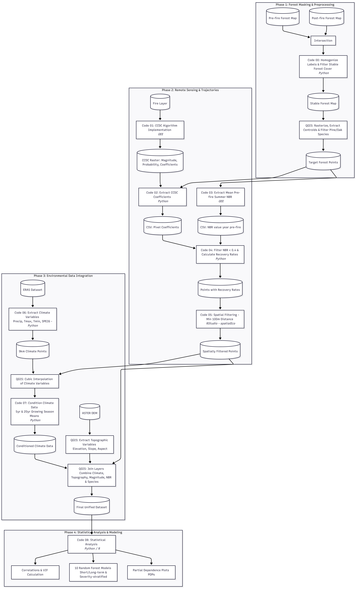

# Short- and Long-Term Drivers of Post-Fire Forest Recovery in Mediterranean Forests

This folder has all the code implemented in the article called "Short- and Long-Term Drivers of Post-Fire Forest Recovery in Mediterranean Forests" written by Ana Laura Giambelluca *(1), Txomin Hermosilla (2), María González-Audícana (1), Jesús Álvarez-Mozos (1)

(1) Institute on Innovation and Sustainable Development in Food Chain (IS-FOOD), Dep. Engineering, Public University of Navarre (UPNA), Campus de Arrosadia, 31006 Pamplona, Spain.
(2) Canadian Forest Service (Pacific Forestry Centre), 506 Burnside Rd W, Victoria, BC V8Z 1M6, Canada.

*Corresponding author: analaura.giambelluca@unavarra.es

[Scripts](Code)

[Reference layers used](Layers)

# Workflow

